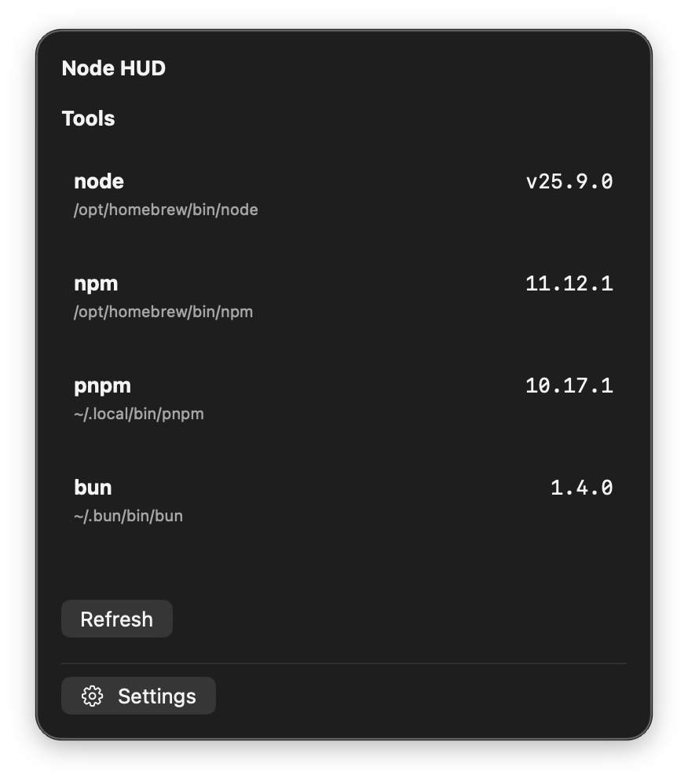

<div align="center">

# Node HUD

**List node / npm / pnpm / bun / yarn on this Mac. Compare majors to a project’s `package.json` `engines`.**

Menu extra for macOS 14+. Lives on the **right** of the menu bar. No Dock icon.

<br/>

[](https://github.com/BadryansahBangsawan/node-hud/actions/workflows/ci.yml)
[](https://github.com/BadryansahBangsawan/node-hud/releases/latest)
[](https://github.com/BadryansahBangsawan/node-hud/releases/latest)

<br/>



| | |
|---|---|
| Product | `NodeHUD` |
| Bundle ID | `engineer.badry.nodehud` |
| Status item | SF Symbol `shippingbox` (`node <major>`, or `Node HUD`) |
| Panel | opaque ~360×420 pt |

</div>

---

## What you get

| Piece | Behavior |
|---|---|
| **Tools** | Locates `node`, `npm`, `pnpm`, `bun`, `yarn`, `fnm`, `volta`. Runs `<tool> --version` with a 3 second timeout. Missing: **not found**. |
| **PATH** | Per tool: Homebrew, `/usr/local`, Volta, asdf, `~/.local`, fnm default, process `PATH`, then login `zsh` `PATH`. |
| **Projects** | Add folders. Reads that folder’s `package.json` only (no walk). Empty: **No projects**. |
| **Engines** | Warns when `engines.node` (and npm/pnpm/bun/yarn) or `packageManager` majors differ. Patch and minor mismatches are ignored. |
| **Refresh** | On appear and from **Refresh**. No timer. |
| **Login** | Open at Login from Settings (`SMAppService`). |

---

## Download

| File | Use |
|---|---|
| **`NodeHUD.app.zip`** | Unzip, drag **NodeHUD** onto **Applications** |

**[Releases](https://github.com/BadryansahBangsawan/node-hud/releases/latest)**

---

## Install

### Zip

1. Download `NodeHUD.app.zip` from [Releases](https://github.com/BadryansahBangsawan/node-hud/releases/latest).
2. Unzip. Drag **NodeHUD** onto **Applications**.
3. First open (ad-hoc signed):

```bash
xattr -cr /Applications/NodeHUD.app
open /Applications/NodeHUD.app
```

Still blocked: System Settings → Privacy & Security → Open Anyway.

### Source

```bash
git clone https://github.com/BadryansahBangsawan/node-hud.git
cd node-hud
bash package-app.sh
ditto dist/NodeHUD.app /Applications/NodeHUD.app
xattr -cr /Applications/NodeHUD.app
open /Applications/NodeHUD.app
```

Do not run `dist/NodeHUD.app` while `/Applications/NodeHUD.app` is running (same bundle ID).

---

## How to open

This is an `LSUIElement` extra. Proof it is running is the **shippingbox** status item on the **right** of the menu bar, not a window from Finder or Launchpad.

1. Click that extra. The panel is opaque ~360×420 pt, not a 10px strip.
2. If the bar is full, look behind the Control Center overflow chevron **«**.
3. Double-clicking in Finder/Launchpad only changes the left-side app name. That is expected. There is no Dock icon.

---

## Usage

1. Click the extra. Tools refresh on appear.
2. **Refresh** to scan again.
3. **Add Project** chooses folders (*Choose a project folder with package.json*).
4. A folder with no root `package.json` shows **No package.json**.
5. Remove a project from its row.
6. **Settings** at the bottom: Open at Login, Quit.

If `/opt/homebrew/bin/node` is `v25.9.0`, the menu title is `node 25`.

---

## Permissions

No TCC prompts. Folder access is the standard open panel.

---

## Data

| What | Where |
|---|---|
| Projects | `~/Library/Application Support/Node HUD/projects.json` |
| Open at Login | `SMAppService.mainApp` (Settings toggle) |

A missing projects file is an empty list (Developer/Documents are not seeded). A file that will not decode is an empty list plus a red banner. The extra does not crash.

---

## Privacy

No network. Tool paths and project folders stay on this Mac. Once per refresh the extra runs `/bin/zsh -lic 'printenv PATH'` locally (3 second timeout). If zsh fails, that PATH is ignored — no banner.

---

## Uninstall

Delete `/Applications/NodeHUD.app`. Then:

```bash
rm -rf "$HOME/Library/Application Support/Node HUD"
```

Turn off **Node HUD** in System Settings → General → Login Items if it remains.

---

## Troubleshooting

| What you see | What to do |
|---|---|
| Finder “opens” nothing / no Dock icon | Click the **shippingbox** extra on the right of the menu bar. |
| Extra missing | Overflow **«**, or `pgrep -x NodeHUD` then `open /Applications/NodeHUD.app`. |
| “Damaged” / cannot verify | `xattr -cr /Applications/NodeHUD.app`. `spctl --assess` is `rejected` even when it runs. |
| **not found** | That binary is not in the candidate paths. |
| **No package.json** | The folder has no `package.json` at its root. |
| **engines.node … vs node …** | Majors differ. Install the engine the project asks for, or change `package.json`. |
| ~10px empty strip under the bar | Reinstall from this repo. |

---

## Build from source

```bash
git clone https://github.com/BadryansahBangsawan/node-hud.git
cd node-hud
swift build -c release --product NodeHUD
bash package-app.sh
open dist/NodeHUD.app
```

Tag `v*` runs CI: `NodeHUD.app.zip`. Never commit `dist/`.

Layout: `Sources/` (SwiftPM executable), `Info.plist`, `Assets/AppIcon.icns`, `package-app.sh`. `FunTheme.swift` is copied verbatim (no shared package).

---

## FAQ

**Why is there no Dock icon?**  
It is a menu extra. Click the shippingbox item on the **right** of the menu bar.

**Does this need network?**  
No. It runs local binaries and reads `package.json`.

**Where did my project list go?**  
`~/Library/Application Support/Node HUD/projects.json`.

**How do I stop it opening at login?**  
Settings in the panel, or System Settings → General → Login Items → **Node HUD**.

---

<div align="center">

[MIT](LICENSE)

</div>
